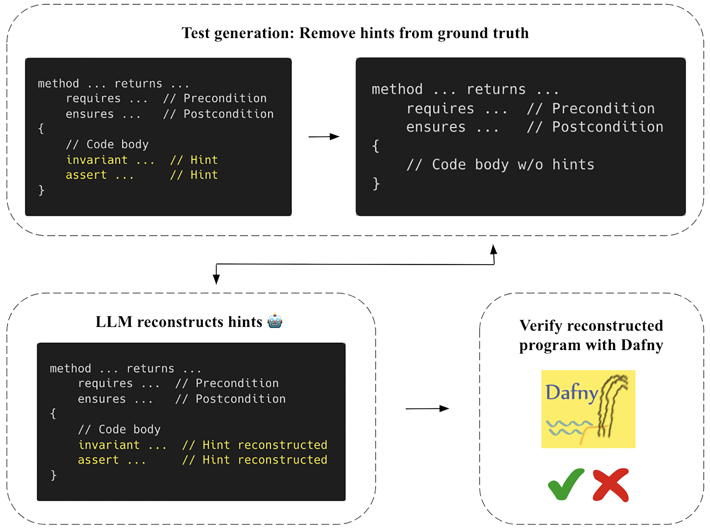

# DafnyBench: A Benchmark for Formal Software Verification

## Overview 📊

DafnyBench is the largest benchmark of its kind for training and evaluating machine learning systems for formal software verification, with over 750 Dafny programs.
<br><br>


## Usage 💻

- <b>Dataset</b>: The dataset for DafnyBench (with 782 programs) could be found in the `DafnyBench` directory, which contains the `ground_truth` set & the `hints_removed`set (with compiler hints, i.e. annoataions, removed).
- <b>Evaluation</b>: Evaluate LLMs on DafnyBench by asking models to fill in missing hints in a test file from the `hints_removed` set and checking if the reconstructed program could be verified by Dafny. Please refer to the `eval` directory.
<br>


<p align="center">
  
</p>
<br><br>


## Set Up for Evaluation 🔧

1. Install Dafny on your machine by following [this tutorial](https://dafny.org/dafny/Installation)
2. Clone & `cd` into this repository
3. Set up environment by running the following lines:
```
python -m venv stats
source stats/bin/activate
pip install -r requirements.txt
cd eval
```
4. Set up environment variable for the root directory:
```
export DAFNYBENCH_ROOT=
```
5. Set up environment variable for path to Dafny executable on your machine (for example, `/opt/homebrew/bin/Dafny`):
```
export DAFNY_PATH=
```
6. If you're evaluating an LLM through API access, set up API key. For example:
```
export OPENAI_API_KEY=
```
7. You can choose to evaluate an LLM on a single test program, such as:
```
python fill_hints.py --model "gpt-4o" --test_file "Clover_abs_no_hints.dfy" --feedback_turn 3 --dafny_path "$DAFNY_PATH"
```
or evaluate on the entire dataset:
```
export model_to_eval='gpt-4o'
./run_eval.sh
```
<br>


## Contents 📁

- `DafnyBench`
  - A collection of 782 Dafny programs. Each program has a `ground_truth` version that is fully verified with Dafny & a `hints_removed` version that has hints (i.e. annotations) removed
- `eval`
  - Contains scripts to evaluate LLMs on DafnyBench
- `results`
  - `results_summary` - Dataframes that summarize LLMs' success on every test program
  - `reconstructed_files` - LLM outputs with hints filled back in
  - `analysis` - Contains a notebook for analyzing the results
